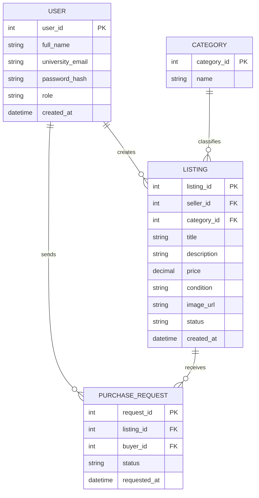

# Sprint 1 — UniMart (University Campus Marketplace)

## 1. Target Audience

UniMart is a campus-focused marketplace built specifically for university students, rather than a generic e-commerce site for the general public.

- **Students (Buyers & Sellers)** — Any enrolled student on campus who wants to buy or sell used textbooks, electronics, furniture, or dorm essentials at student-friendly prices, verified through a university email address.
- **Graduating/Outgoing Students** — Students leaving campus who want a fast way to sell items (furniture, appliances, textbooks) instead of discarding them.
- **Incoming/New Students** — Students who need affordable secondhand items (textbooks, dorm supplies) at the start of a semester without the cost of buying new.
- **Budget-Conscious Students** — Students generally looking for cheaper alternatives to retail prices, comfortable meeting on campus to complete a transaction.

**Key characteristics of the target audience:**
- Verified via a university email address (adds trust and restricts access to genuine students).
- Prefer in-person, on-campus pickup over shipping — reduces cost and delivery complexity.
- Mostly interested in textbooks, electronics, furniture, and dorm/hostel essentials.
- Comfortable using a simple web app on both desktop and mobile browsers.

## 2. MVP Features

The Minimum Viable Product (MVP) for Sprint 1 focuses on the core features needed to validate UniMart end-to-end.

### Student-Facing Features
- **User Authentication** — Sign up and log in using a university email address; log out.
- **Product Listings** — Browse items by category (Textbooks, Electronics, Furniture, Dorm Essentials, Other), search by keyword, view listing details (photos, price, description, seller, condition).
- **Create a Listing** — A student can list an item for sale with a title, description, price, category, condition, and photo.
- **Shopping Cart / Interest List** — Add items to a cart or "interested" list before contacting the seller.
- **Order/Request Flow** — Buyer submits a request to purchase; seller confirms and the two arrange an on-campus pickup (no shipping required for MVP).
- **Order History** — View past listings sold and items purchased.

### Admin-Facing Features
- **Listing Moderation** — Admin can view and remove inappropriate or duplicate listings.
- **User Management** — Admin can view registered users and deactivate accounts if needed.

### Out of Scope for Sprint 1 (Future Sprints)
- Online payment integration (MVP assumes cash/in-person payment on pickup).
- Ratings & reviews for buyers/sellers.
- In-app chat/messaging between buyer and seller (MVP can use a contact email or phone number field).
- Shipping/delivery options beyond campus pickup.
- Push notifications.

## 3. Tech Stack

| Layer | Technology | Reason |
|---|---|---|
| **Frontend** | HTML, CSS, JavaScript (vanilla) | No framework overhead — straightforward to build, debug, and explain for a course project |
| **Backend** | Python (Flask) | Lightweight Python web framework, quick to set up REST routes and render pages, good fit for a student SDLC project |
| **Database** | SQLite | Simple file-based database — no separate server to install/configure, ideal for an MVP; can migrate to PostgreSQL/MySQL later if the project scales |
| **Authentication** | Flask sessions + password hashing (Werkzeug) | Built into Flask's ecosystem, no extra dependencies needed |
| **Version Control** | Git & GitHub | Source control and submission for the course |
| **API Testing** | Postman / browser dev tools | Manual testing of backend routes during development |
| **Hosting (planned)** | Render / PythonAnywhere | Free-tier friendly hosting for Flask apps if a live demo is required |

> If your course specifically requires Django instead of Flask, the same SQLite database and HTML/CSS/JS frontend still apply — only the backend framework choice changes.

## 4. Entity Relationship Diagram (ERD)

**Entity Summary:**
- **USER** — Registered students (and admins, distinguished by `role`), verified via `university_email`.
- **CATEGORY** — Listing categories (Textbooks, Electronics, Furniture, Dorm Essentials, Other).
- **LISTING** — An item a student has posted for sale, linked to a seller and a category, with a `status` (Available, Reserved, Sold).
- **PURCHASE_REQUEST** — A buyer's request to purchase a listing; tracks `status` (Pending, Accepted, Rejected, Completed) as the buyer and seller arrange campus pickup.
