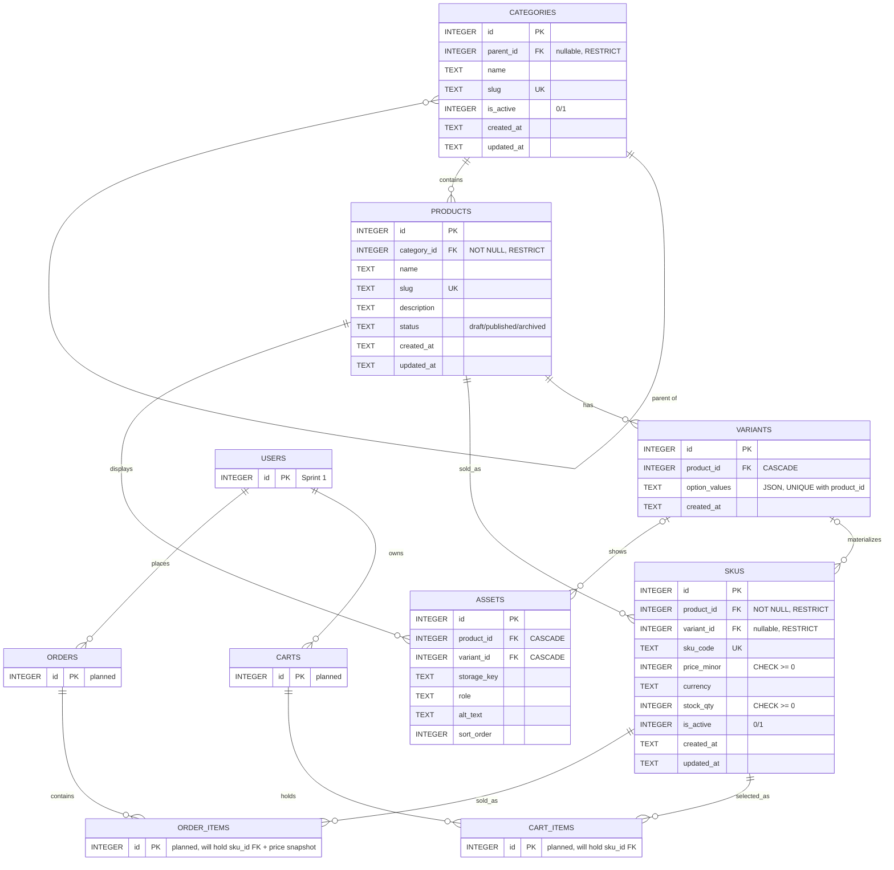

# Sprint 2 – Catalog Data Foundation (UniMart)

## 1. Sprint goal and scope boundary
**Goal:** an administrator can persist categories, products, variants and SKUs without losing identity, relationship, price or inventory meaning.

**In scope:** category tree, product CRUD (draft by default), variants, SKUs (unique code, price, stock), protected admin API, DB constraints, migrations, seed data, automated tests.

**Out of scope (Sprint 3+):** dynamic specifications, asset upload (the `assets` table exists as schema only), public catalog search, publication workflow beyond the one rule below, payments, orders, shipping, checkout.

## 2. Link to Sprint 1 decisions
| Sprint 1 (`docs/SPRINT_1.md`) | Sprint 2 |
|---|---|
| Stack: Flask + SQLite + vanilla JS | **Reused** unchanged. Migrations are plain SQL files applied by `db.py` (`migrations/001_catalog.sql`). |
| `CATEGORY` entity | **Extended** to `categories` with `parent_id`, `slug`, `is_active`, timestamps (two-level tree for subjects such as Books → Textbooks). |
| `LISTING` entity | **Split** into `products` (what it is), `variants` (option combination) and `skus` (the sellable unit with price and stock). A student listing becomes a product with one SKU. |
| `PURCHASE_REQUEST` entity | **Planned** to evolve into `orders` / `order_items`, which reference `skus` (see ERD). Not built in Sprint 2. |
| Admin role (moderation) | **Reused**: admin API uses a bearer token. `ADMIN_TOKEN` = administrator, `STUDENT_TOKEN` = authenticated non-admin (403). |
| `USER` (university email) | Not touched. `products.seller_id → users.id` is a Sprint 3 backlog item. |

## 3. Updated ERD and data dictionary

*Planned tables (CARTS, CART_ITEMS, ORDERS, ORDER_ITEMS, USERS) are not implemented in Sprint 2. Carts and order items point at `SKUS`, not products, because the SKU carries price and stock. The Sprint 2 brief's baseline diagram shows `PRODUCTS → CART_ITEMS`; we deliberately link cart items to SKUs instead so a cart line always has an unambiguous price.*

**Cardinality and delete/update policy**

| Relationship | Cardinality | On delete | On update |
|---|---|---|---|
| categories.parent_id → categories | 0..1 parent : many children | RESTRICT | CASCADE |
| products.category_id → categories | 1 category : many products | RESTRICT | CASCADE |
| variants.product_id → products | 1 product : many variants | CASCADE | CASCADE |
| skus.product_id → products | 1 product : many SKUs | RESTRICT | CASCADE |
| skus.variant_id → variants | 0..1 variant : many SKUs | RESTRICT | CASCADE |
| assets.product_id / variant_id | many assets per product/variant | CASCADE | n/a |

**Data dictionary highlights**
- `price_minor`: integer minor units (paisa). `4500000` = PKR 45,000.00. No floats anywhere.
- `option_values`: canonical JSON with sorted keys, e.g. `{"color":"silver","ram":"8GB"}`. `UNIQUE(product_id, option_values)` blocks duplicate combinations.
- `skus.variant_id` is NULL for products with no variants (e.g. a textbook).
- `status`: `draft` → `published` → `archived`.
- Specifications are Sprint 3.

## 4. Administration routes
All routes are under `/api/v1/admin`, need `Authorization: Bearer <token>`, and return JSON. Errors always look like `{"error": {"code": "...", "message": "..."}}`.

| Method | Route | Purpose | Success | Main errors |
|---|---|---|---|---|
| POST | `/categories` | Create category. Body: `name`, `slug`, optional `parent_id` | 201 | 401, 403, 409 `DUPLICATE_SLUG`, 422 |
| GET | `/categories` | Category tree (nested `children`) | 200 | 401, 403 |
| PATCH | `/categories/:id` | Update `name`, `slug`, `parent_id`, `is_active` | 200 | 404, 409 `PARENT_INACTIVE`, 422 `CATEGORY_CYCLE` |
| POST | `/products` | Create draft product. Body: `name`, `slug`, `category_id`, optional `description` | 201 | 409 `DUPLICATE_SLUG`, 422 |
| GET | `/products` | All products with `variants` and `skus` | 200 | 401, 403 |
| PATCH | `/products/:id` | Update content, `category_id`, `status` | 200 | 404, 422 `NO_ACTIVE_SKU`, 409 |
| POST | `/products/:id/variants` | Add variant. Body: `option_values` object | 201 | 409 `DUPLICATE_VARIANT`, 422 |
| POST | `/products/:id/skus` | Add SKU. Body: `sku_code`, `price_minor`, optional `stock_qty`, `variant_id`, `is_active` | 201 | 409 `DUPLICATE_SKU`, 422 |
| PATCH | `/skus/:id` | Update `price_minor`, `stock_qty`, `is_active` | 200 | 404, 422 |

Status codes: 401 missing/invalid token, 403 valid token but not admin, 404 unknown id, 409 duplicate or foreign-key conflict, 422 validation failure, 400 body is not JSON.

Worked examples with real output are in section 6.

## 5. Data integrity and authorization decisions
- **Database enforces the rules, not only the API:** `UNIQUE` on category slug, product slug, SKU code and (product, option_values); `CHECK (stock_qty >= 0)`, `CHECK (price_minor >= 0)`; `CHECK (parent_id <> id)`; foreign keys with `PRAGMA foreign_keys = ON` on every connection. Tests insert bad data directly into SQLite to prove this.
- **Cycle prevention:** on a parent change we walk up from the new parent; reaching the category itself is rejected with `CATEGORY_CYCLE`.
- **Valid combinations only:** a missing combination (e.g. 8GB + black laptop) simply has no variant and no SKU row. We never create zero-stock placeholder SKUs. All variants of one product must use the same option names.
- **Auth:** `@admin_required` returns 401 when there is no/invalid token and 403 for a valid non-admin token. Tokens come from environment variables and are compared in constant time.
- **Errors:** database `IntegrityError`s are converted to 409/422 JSON, and unexpected errors become a generic 500 JSON, so clients never see a traceback.

### Business-rule answers (section 8 of the brief)
1. **Draft with no SKU / published with no SKU?** A draft may have no SKU. Publishing needs at least one *active* SKU; otherwise `422 NO_ACTIVE_SKU` (test `test_publish_requires_active_sku`).
2. **One or many categories?** One canonical category per product (`products.category_id NOT NULL`). It keeps navigation and breadcrumbs simple; many-to-many can be added later via a join table.
3. **Parent category deactivated?** All descendants are deactivated too. A child cannot be reactivated while its parent is inactive (`PARENT_INACTIVE`). New products cannot be placed in an inactive category.
4. **Out-of-stock representation?** The SKU stays in the response with `"stock_qty": 0` and `"in_stock": false`; it is not deleted.
5. **Shared prices / price override?** Two SKUs may share a price (test exists). Each SKU owns its own `price_minor`, so there is no separate override: a variant's price *is* its SKU price.
6. **What prevents negative stock and duplicate SKU codes?** API validation (422/409) plus `CHECK` and `UNIQUE` constraints in the database.
7. **Product deactivated after a cart/order references it?** Rows are never hard-deleted (`skus.product_id` is RESTRICT). Setting a product to `archived` or a SKU `is_active=false` hides it from sale while old carts and orders keep a valid reference. Order items will store a price snapshot.

## 6. Seed data and demonstration
**Reproduce on a clean database**
```bash
rm -f unimart.db
python seed.py          # safe to run twice; it does not duplicate rows
```
Seed contents: categories Electronics → Laptops and Books → Textbooks (two levels); 3 products; 3 variants of the laptop; 5 SKUs. The combination **8GB + black** of the laptop is intentionally missing. The desk lamp has stock 0.

**Administrator demo** (generated by `python demo.py`; token redacted):

### 1. Create a category
```http
POST /api/v1/admin/categories
Authorization: Bearer <REDACTED>
{
  "name": "Laptops",
  "slug": "laptops"
}
```
Response `201`:
```json
{
  "created_at": "2026-10-01 05:07:26",
  "id": 1,
  "is_active": true,
  "name": "Laptops",
  "parent_id": null,
  "slug": "laptops",
  "updated_at": "2026-10-01 05:07:26"
}
```

### 2. Create a draft product
```http
POST /api/v1/admin/products
Authorization: Bearer <REDACTED>
{
  "name": "HP ProBook",
  "slug": "hp-probook",
  "description": "Used laptop",
  "category_id": 1
}
```
Response `201`:
```json
{
  "category_id": 1,
  "created_at": "2026-10-01 05:07:26",
  "description": "Used laptop",
  "id": 1,
  "name": "HP ProBook",
  "skus": [],
  "slug": "hp-probook",
  "status": "draft",
  "updated_at": "2026-10-01 05:07:26",
  "variants": []
}
```

### 3. Create a variant
```http
POST /api/v1/admin/products/1/variants
Authorization: Bearer <REDACTED>
{
  "option_values": {
    "ram": "8GB",
    "color": "silver"
  }
}
```
Response `201`:
```json
{
  "id": 1,
  "option_values": {
    "color": "silver",
    "ram": "8GB"
  },
  "product_id": 1
}
```

### 4. Create a SKU (price in minor units: 4500000 = PKR 45,000.00)
```http
POST /api/v1/admin/products/1/skus
Authorization: Bearer <REDACTED>
{
  "sku_code": "HP-PB-8-SIL",
  "price_minor": 4500000,
  "stock_qty": 3,
  "variant_id": 1
}
```
Response `201`:
```json
{
  "currency": "PKR",
  "id": 1,
  "in_stock": true,
  "is_active": true,
  "price_minor": 4500000,
  "product_id": 1,
  "sku_code": "HP-PB-8-SIL",
  "stock_qty": 3,
  "variant_id": 1
}
```

### 5. Retrieve products with variants and SKUs
```http
GET /api/v1/admin/products
Authorization: Bearer <REDACTED>

```
Response `200`:
```json
{
  "data": [
    {
      "category_id": 1,
      "created_at": "2026-10-01 05:07:26",
      "description": "Used laptop",
      "id": 1,
      "name": "HP ProBook",
      "skus": [
        {
          "currency": "PKR",
          "id": 1,
          "in_stock": true,
          "is_active": true,
          "price_minor": 4500000,
          "product_id": 1,
          "sku_code": "HP-PB-8-SIL",
          "stock_qty": 3,
          "variant_id": 1
        }
      ],
      "slug": "hp-probook",
      "status": "draft",
      "updated_at": "2026-10-01 05:07:26",
      "variants": [
        {
          "id": 1,
          "option_values": {
            "color": "silver",
            "ram": "8GB"
          }
        }
      ]
    }
  ]
}
```

### 6. Duplicate SKU is rejected (clean 409, no traceback)
```http
POST /api/v1/admin/products/1/skus
Authorization: Bearer <REDACTED>
{
  "sku_code": "HP-PB-8-SIL",
  "price_minor": 1,
  "variant_id": 1
}
```
Response `409`:
```json
{
  "error": {
    "code": "DUPLICATE_SKU",
    "message": "A SKU with this code already exists."
  }
}
```

### 7. No token is rejected
```http
POST /api/v1/admin/categories
{
  "name": "X",
  "slug": "x"
}
```
Response `401`:
```json
{
  "error": {
    "code": "UNAUTHENTICATED",
    "message": "Missing bearer token."
  }
}
```


## 7. Test strategy, command and result
Tests use Python's built-in `unittest` against a temporary SQLite file per test. Each business rule has a success test and at least one rejection test: creation with required fields, duplicate slug / SKU / variant, category cycle and self-parent, variant–SKU combination rules, negative stock (API and database), publish rule, 401/403 on all nine routes, FK enforcement, and seed reproducibility.

```bash
python -m unittest discover -s tests -v
```
Result:
```
Ran 28 tests

OK
```

## 8. Known limitations and Sprint 3 backlog
- Auth is a static bearer token; real login with the Sprint 1 `users` table and roles is Sprint 3.
- `products.seller_id` (who listed the item) is not modelled yet.
- No delete endpoints: the brief's "deactivate" is used instead of hard delete.
- No pagination on `GET /products`.
- Sprint 3 backlog: dynamic specifications (validation rule: JSON schema per category), asset upload, public catalog read/search, publication rules, carts (`CART_ITEMS.sku_id`), orders (`ORDER_ITEMS.sku_id` + price snapshot), migration to PostgreSQL if needed.
